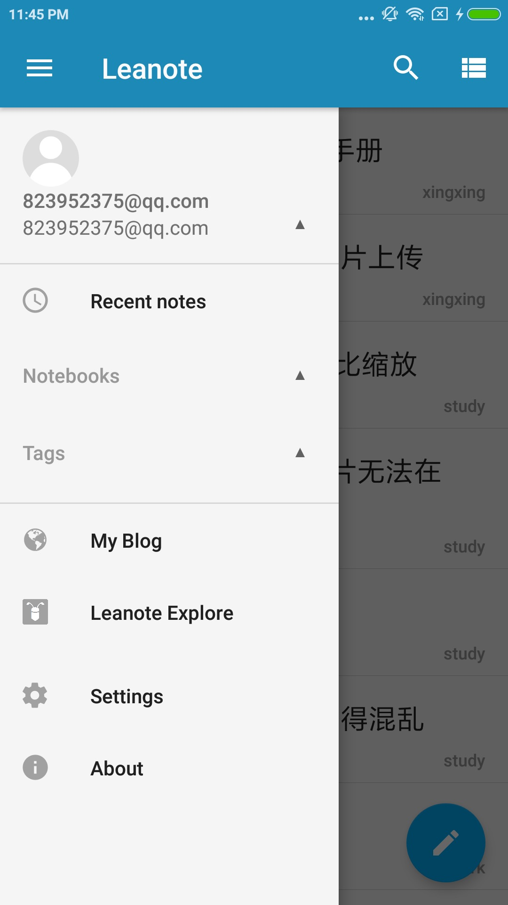
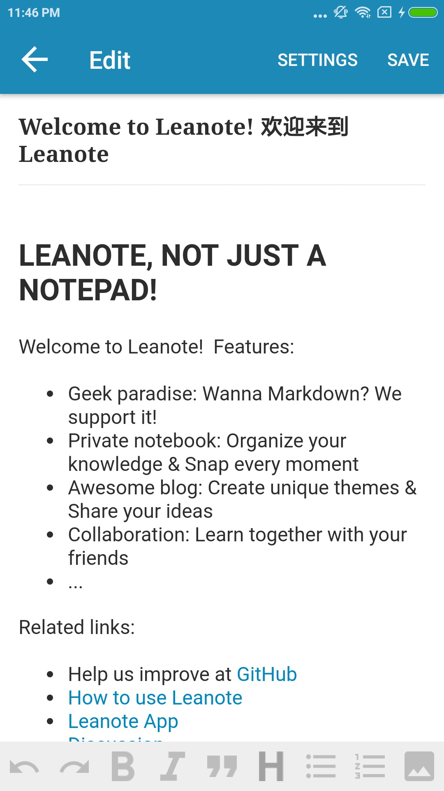
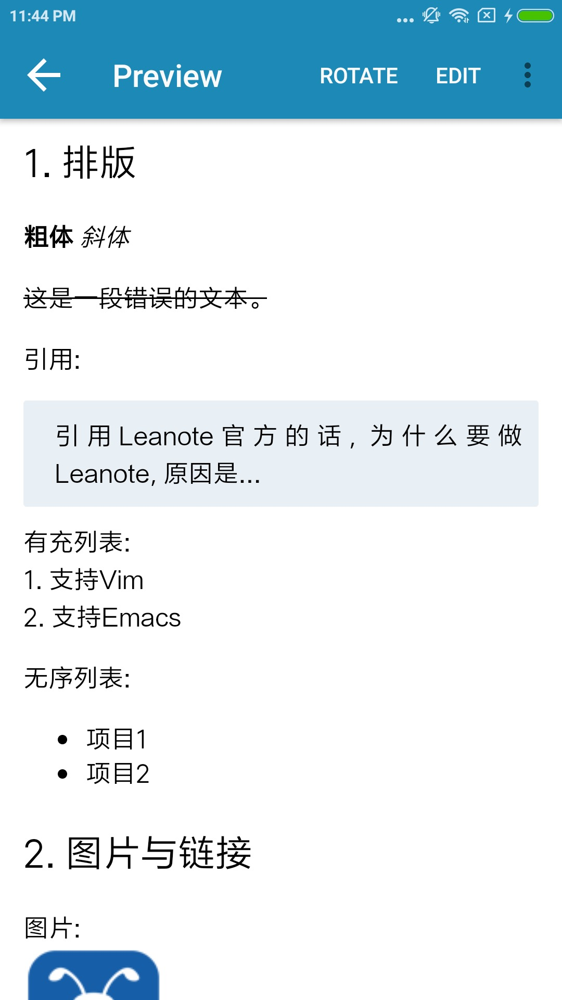
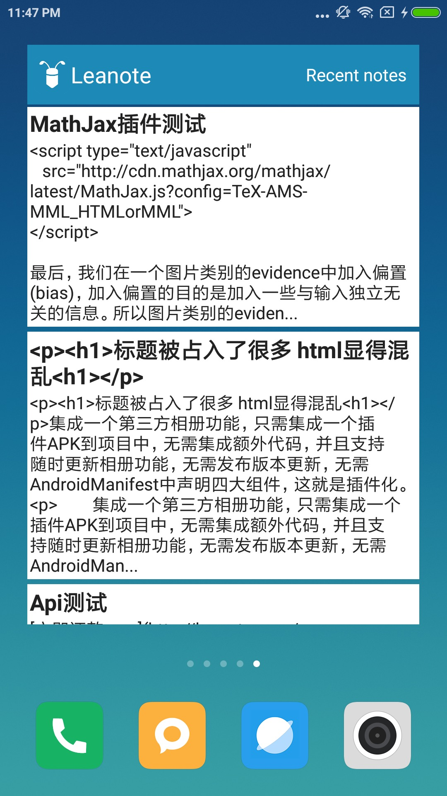

# New Leanote Android (Leamonax)

**还在开发阶段.** 使用前请先备份，避免重要数据丢失.

# 预览图
&ensp; &ensp;&ensp; &ensp;  

&ensp; &ensp;&ensp; &ensp;  

# 下载地址
- [Git Release](https://github.com/leanote/leanote-android/releases/latest)
- [Pgyer](https://www.pgyer.com/Leanote)

# Features
- [x] 登陆注册
- [x] 浏览笔记，同步笔记
- [x] 支持富文本编辑器
- [x] 支持Markdown编辑器
- [x] 自建域名
- [x] 根据title查找笔记
- [x] appWidget小组件

# TODO
- [ ] 全文搜索

# 贡献者

- [houxg](https://github.com/houxg)
- [xingstarx](https://github.com/xingstarx)
- [nicacol](https://github.com/nicacol)
- [Ericwyn](https://github.com/Ericwyn)
- [binsheng](https://github.com/binsheng)
